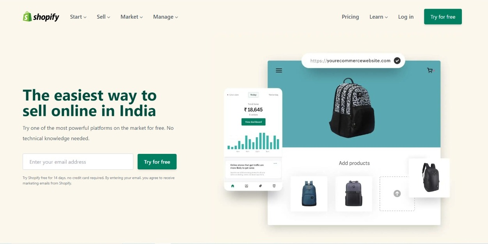

# Assignment-Tailwind Css 
## (Shopify Clone Page) 

> In this project, I have used HTML (the Hypertext Markup Language) and Tailwind CSS, which are two of the core technologies for building Web pages. It is a responsive page.

## (video demo)

### As a result of this project, I learn the following:
[LIVE-LINK](https://project-shopify-clone.netlify.app/)

- [x] learned about Tailwind CSS

#### The duration of the project:6 hour